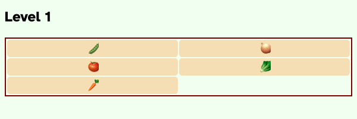
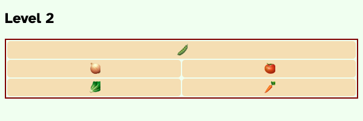
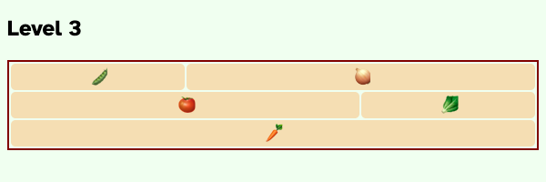
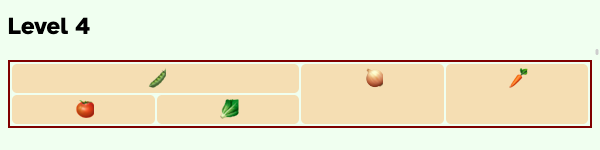
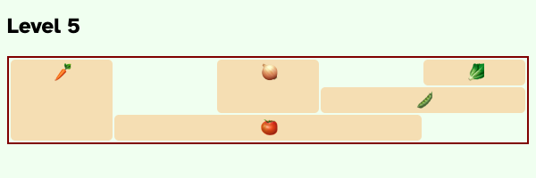
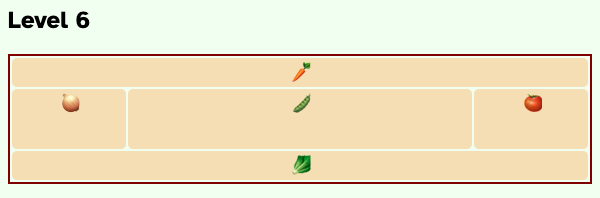
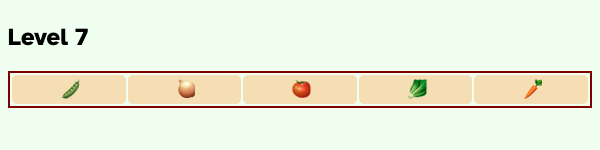
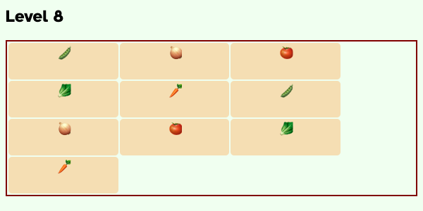
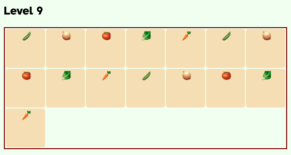

# Garden

Spring is approaching and some gardeners are discussing how they want to organize their plot this year. In this workshop, you'll be using grid to help them visualize increasingly persnickety garden designs!

## Getting Started

1. Create a new repository under your GitHub account using this one as a template.
2. Clone your repository down to your local machine.
3. Open the cloned folder with VS Code.
4. Live serve `index.html` to see the page that you will have to style.

## Instructions

1. Read through the code that has already been given to you in `index.html` and `index.css`.
2. Complete each level in the given order by writing CSS in `levels.css` to match the provided table. Each level is more difficult than the next. Make sure you are styling the grid container and grid items that correspond to the level!

## Levels

### Level 1

|     | 1        | 2       |
| --- | -------- | ------- |
| 1   | peas     | onions  |
| 2   | tomatoes | lettuce |
| 3   | carrots  |         |

### Level 2

|     | 1       | 2        |
| --- | ------- | -------- |
| 1   | peas    | peas     |
| 2   | onions  | tomatoes |
| 3   | lettuce | carrots  |

### Level 3

|     | 1        | 2        | 3       |
| --- | -------- | -------- | ------- |
| 1   | peas     | onions   | onions  |
| 2   | tomatoes | tomatoes | lettuce |
| 3   | carrots  | carrots  | carrots |

### Level 4

|     | 1        | 2       | 3      | 4       |
| --- | -------- | ------- | ------ | ------- |
| 1   | peas     | peas    | onions | carrots |
| 2   | tomatoes | lettuce | onions | carrots |

### Level 5

| | 1 | 2 | 3 | 4 | 5 |
|---|---------|----------|----------|----------|---------|
| 1 | carrots | | onions | | lettuce |
| 2 | carrots | | onions | peas | peas |
| 3 | carrots | tomatoes | tomatoes | tomatoes | |

### Level 6

| | 1 | 2 | 3 | 4 | 5 |
|---|---------|----------|----------|----------|---------|
| 1 | carrots | carrots | carrots | carrots | carrots |
| 1 | onions | peas | peas | peas | tomatoes |
| 1 | onions |peas | peas |peas | tomatoes |
| 1 | lettuce | lettuce | lettuce | lettuce | lettuce |

### Level 7

What if we want the _width_ of each column to respond to the viewport width?

For this level, use [repeat](https://developer.mozilla.org/en-US/docs/Web/CSS/repeat)
and [minmax](https://developer.mozilla.org/en-US/docs/Web/CSS/minmax)
to make 5 columns that are at _minimum_ `5ch` wide, but will expand to a
_maximum_ of `1fr` wide.

### Level 8

What if we want the _number_ of columns to respond to the viewport width?

For this level, use [repeat auto-fit](https://developer.mozilla.org/en-US/docs/Web/CSS/repeat#auto-fit)
to fit as many `15ch`-wide grid items as possible in each row. This will force a
grid item to wrap to a new row if it can't fit in the previous row.

Use [grid-auto-rows](https://developer.mozilla.org/en-US/docs/Web/CSS/grid-auto-rows)
to make each automatically generated row `5ch` tall.

### Level 9

Use `repeat`, `auto-fit`, `minmax`, and `grid-auto-rows` so that:

- each row should fit as many grid items as possible
- each grid item is at least `5rem` wide
- each grid item grows to take up `1fr` of the available space
- automatically generated rows are `5rem` high

Try your best!

## Submission

Please submit the link to your public GitHub repository.
